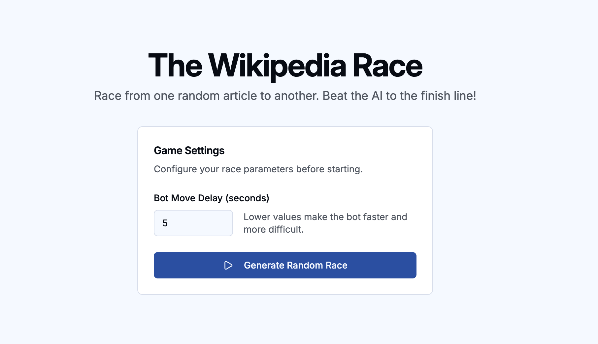

# Wikipedia Racer

**Wikipedia Racer** is an interactive, web-based game where a human player competes against an AI bot to navigate from a starting Wikipedia article to a target article. The project serves as an **Implementation Project**, leveraging real-world data to explore complex networks.

## Core Concepts Explored

- **Graph and Graph Algorithms:** Wikipedia is modeled as a massive directed graph (articles as nodes, links as edges). The bot utilizes a priority-queue-based traversal algorithm (Best-First Search) to navigate.
- **Information Networks:** The project interacts with the World Wide Web, dynamically scraping and caching the Wikipedia ecosystem to create a playable information network.
- **Document Search (Information Retrieval):** The bot evaluates paths using natural language processing (NLP) embeddings, computing semantic similarity scores between hyperlink texts and the target article to make intelligent decisions.

---

## Deliverables: Implementation Project

### 1. Code

The codebase is divided into two main components:

- `**frontend/`**: A React application built with TypeScript, Vite, and shadcn/ui. Handles the user interface, Wikipedia iframe rendering, and real-time WebSocket communication.
- `**backend/`**: A FastAPI application using SQLAlchemy and SQLite. Handles Wikipedia scraping, link caching, graph traversal, and NLP embeddings using `all-mpnet-base-v2`.

### 2. User Manual

#### Prerequisites

- Python 3.10+
- Node.js (v18+) & npm

#### Setup & Running

**Backend Initialization:**

1. Navigate to the backend directory:
  ```bash
   cd backend
  ```
2. Create and activate a virtual environment:
  ```bash
   python -m venv venv
   source venv/bin/activate  # On Windows: venv\Scripts\activate
  ```
3. Install dependencies:
  ```bash
   pip install -r requirements.txt
  ```
4. Navigate back to root folder
  ```bash
   cd ..
  ```
5. Start the server (runs on `http://localhost:8000`):
  ```bash
   python -m backend.app.main
  ```

**Frontend Initialization:**

1. Open a new terminal and navigate to the frontend directory:
  ```bash
   cd frontend
  ```
2. Install dependencies:
  ```bash
   npm install
  ```
3. Start the development server (runs on `http://localhost:5173`):
  ```bash
   npm run dev
  ```

---

#### How to Play & Functionality

1. **Lobby & Game Settings:**
  When you first load the application, you will be greeted by the lobby screen.
  - **Bot Move Delay:** You can configure the difficulty of the AI bot. Lowering the delay (in seconds) makes the bot move faster, while a higher delay gives you more time to read and click.
  - Click **"Generate Random Race"** to fetch a random start and target article.
   

2. **The Race View:**
  Once a race is generated, you will see the "Ready?" screen showing the start and target articles.
  - Click **"START RACE!"** to begin.
  - **Main Panel:** A fully interactive Wikipedia iframe locked to the game's ecosystem. You must navigate using only the blue hyperlinks in the article text.
  - **Sidebar Panel:** Displays the target article, a live game timer, and a real-time activity log of the bot's path.
   *[Insert Screenshot: Active Game View (Iframe & Sidebar)]*
   `<!-- Screenshot placeholder: active_game.png -->`
3. **Bot Activity Log:**
  The bot's progress is broadcasted via WebSockets in real-time. You can watch exactly which pages the bot is visiting as it attempts to find the target.
   *[Insert Screenshot: Bot Activity Log scrolling]*
   `<!-- Screenshot placeholder: bot_log.png -->`
4. **Victory/Defeat Screen:**
  The game ends when either you or the bot reaches the target article.
  - If the bot wins, the defeat screen will display the exact path the AI took to beat you, allowing you to analyze its semantic traversal logic.
   *[Insert Screenshot: Game Over Screen showing AI Path]*
   `<!-- Screenshot placeholder: game_over.png -->`

